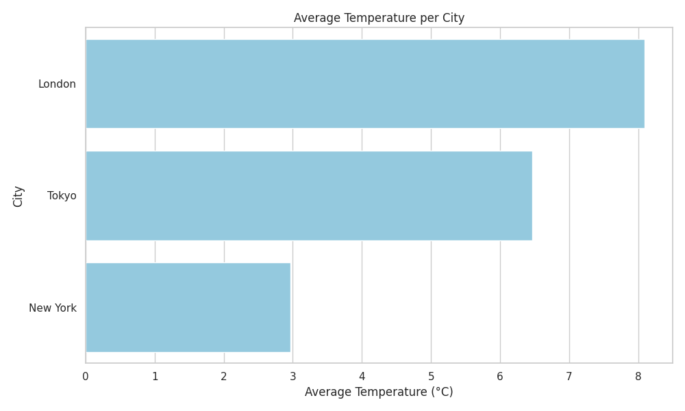

# Weather-Data-Processing-Pipeline

## Overview

This project implements a weather data processing pipeline using Python and pandas. The pipeline ingests raw weather data, cleans and transforms it, and outputs both a cleaned CSV and a visualization of average temperature per city.

---

## 1. Step-by-step Instructions to Run the Pipeline Locally

### Run the Pipeline

1. **Clone or download this repository.**
2. **Place your raw weather data CSV as `weather_data.csv` in the project root (I have  provided).**
3. **Open and run the notebook:**

   -run the Python code in the notebook as a script (after extracting code cells).

4. **Outputs:**
   - Cleaned and transformed data: `outputs/tranformed_weather_data.csv`
   - Visualization: `outputs/average_temperature_per_city.png`

---

## 2. Approach and Challenges

### Approach

- **Data Ingestion:** Load the raw CSV using pandas.
- **Cleaning & Transformation:**
  - Drop rows with missing dates.
  - Fill missing temperatures with the mean temperature for each city.
  - Standardize date formats.
  - Remove rows with missing or "Unknown" weather conditions.
  - Add a Fahrenheit temperature column.
- **Output:** Save the cleaned data and generate a bar plot of average temperature per city.

### Challenges

- **Inconsistent Date Formats:** The raw data contains dates in multiple formats (e.g., `2023-01-01`, `01/02/2023`, `14.01.2023`). Used `pd.to_datetime` with `errors='coerce'` to standardize and drop unparseable dates.
- **Missing Values:** Some temperature and humidity values are missing. Used group-wise mean imputation for temperatures.
- **Weather Condition Variants:** Some rows have "Unknown", "unknown", or empty weather conditions. Filtered these out for analysis.
- **Data Quality:** Some rows have multiple missing fields, requiring careful filtering to avoid introducing bias.

---

## 3. Sample Output

### Cleaned Data 

```
[{'date': '2023-01-01', 'city': 'New York', 'temperature_celsius': 5.0, 'humidity_percent': 60.0, 'wind_speed_kph': 10.0, 'weather_condition': 'Sunny', 'temperature_fahrenheit': 41.0},
 {'date': '2023-01-02', 'city': 'London', 'temperature_celsius': 6.0, 'humidity_percent': 75.0, 'wind_speed_kph': 20.0, 'weather_condition': 'Snowy', 'temperature_fahrenheit': 42.8},
 {'date': '2023-01-01', 'city': 'Tokyo', 'temperature_celsius': 10.0, 'humidity_percent': 50.0, 'wind_speed_kph': 5.0, 'weather_condition': 'Sunny', 'temperature_fahrenheit': 50.0},
 {'date': '2023-01-12', 'city': 'Tokyo', 'temperature_celsius': 6.914285714285714, 'humidity_percent': 61.0, 'wind_speed_kph': nan, 'weather_condition': 'RAINY', 'temperature_fahrenheit': 44.44571428571429},
 {'date': '2023-01-05', 'city': 'London', 'temperature_celsius': 10.185714285714285, 'humidity_percent': 60.0, 'wind_speed_kph': nan, 'weather_condition': 'Rainy', 'temperature_fahrenheit': 50.33428571428571}]
```

### Visualization



---

